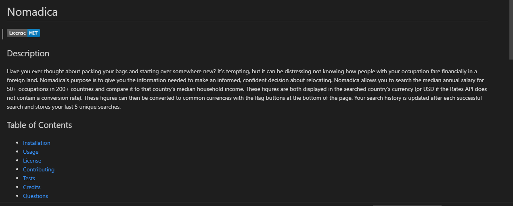

# Readme Generator

## Description

There's no one right way to structure a good README. There is one very wrong way, however, and that is to not include a README at all. This README generator creates an outline with a couple good practices. As you progress in your career, you will develop your own ideas about what makes a good README. At the minimum, your generated README needs a title and a short description explaining the what, why, and how. What was your motivation? Why did you build this project? What problem does it solve? What did you learn? What makes your project stand out?

* [Installation](#installation)
* [Usage](#usage)
* [License](#license)
* [Contributing](#contributing)
* [Tests](#tests)
* [Credits](#credits)
* [Questions](#questions)
    
## Installation

    npm i

## Usage
    
After you install the required node modules, in the terminal type in  
    
    node index.js
   
to run the program. It will run the code and start to ask you a series of questions used to fill out the README template

## License

Licensed under the [MIT License](LICENSE.txt).

## Contributing

If you want to contribute just make sure to respect the copyright and give credit where credit is due. If there is a particular issue that you're dealing with, consider submitting an issue so that we may try to correct the bug or fix it yourself and submit a pull request. Hopefully one of the moderators will review and accept the changes if it improves the overall performance.
    

## Tests

    npm test

## Credits

Special thanks to my kids and my wife for pushing me to do better

## Questions

My [GitHub](https://github.com/junioresc/)  
If you have any additional questions and would like to reach me, you can at junioresc1092@gmail.com
  
